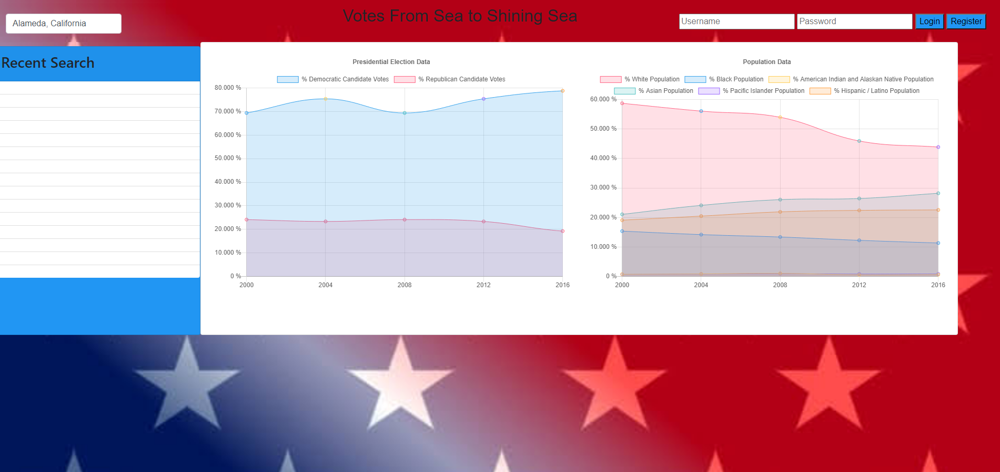

# County-Election-Results-Project




Description
------------


AS a voter, pollster, or politician I want an app where i can view the voter turn out from previous presidential elections. I want to be able to search for votes by county. I want to see the total votes collected by the republican, democratic, and green parties

<br>

## Table of contents

[Built with](#Built-with)<br>
[Features](#Features)<br>
* [Search votes by county](#Search-votes-by-county)<br>
* [See votes collected by each party](#See-votes-collected-by-each-party)<br>
* [Create a user login and sign up](#Create-a-user-login-and-sign-up)<br>

[Deployed Link](#Deployed-link)<br>
[Authors](#Authors)<br>
[License](#License)

<br>

## Built with

* [HTML](https://developer.mozilla.org/en-US/docs/Web/HTML)
* [CSS](https://developer.mozilla.org/en-US/docs/Web/CSS)
* [Javascript](https://developer.mozilla.org/en-US/docs/Web/JavaScript)

<br>

## Features
---------------------------------

## Search votes by county

```

```
<br>

## See votes collected by each party

```

```
<br>

## Create a user login and sign up

```

```
<br>


## Deployed link

* [See Live Site]()

<br>

## Authors

**Jasmine Franklin** 

- [Link to Portfolio Site](https://jas-f.github.io/responsive-portfolio/index.html)
- [Link to Github](https://github.com/Jas-F/global-weather-dashboard)
- [Link to LinkedIn](https://www.linkedin.com/in/jasmine-franklin-8b08ba121).

**James Merges** 

- [Link to Portfolio Site]()
- [Link to Github]()
- [Link to LinkedIn]()

**Vincent Nguyen** 

- [Link to Portfolio Site]()
- [Link to Github]()
- [Link to LinkedIn]()

<br>

## License

MIT License

Copyright (c) [2021] [Jasmine Franklin, James Merges, & Vincent Nguyen]

Permission is hereby granted, free of charge, to any person obtaining a copy
of this software and associated documentation files (the "Software"), to deal
in the Software without restriction, including without limitation the rights
to use, copy, modify, merge, publish, distribute, sublicense, and/or sell
copies of the Software, and to permit persons to whom the Software is
furnished to do so, subject to the following conditions:

The above copyright notice and this permission notice shall be included in all
copies or substantial portions of the Software.

THE SOFTWARE IS PROVIDED "AS IS", WITHOUT WARRANTY OF ANY KIND, EXPRESS OR
IMPLIED, INCLUDING BUT NOT LIMITED TO THE WARRANTIES OF MERCHANTABILITY,
FITNESS FOR A PARTICULAR PURPOSE AND NONINFRINGEMENT. IN NO EVENT SHALL THE
AUTHORS OR COPYRIGHT HOLDERS BE LIABLE FOR ANY CLAIM, DAMAGES OR OTHER
LIABILITY, WHETHER IN AN ACTION OF CONTRACT, TORT OR OTHERWISE, ARISING FROM,
OUT OF OR IN CONNECTION WITH THE SOFTWARE OR THE USE OR OTHER DEALINGS IN THE
SOFTWARE.

<p>&copy; UC Berkeley Extension Bootcamp.</p>
